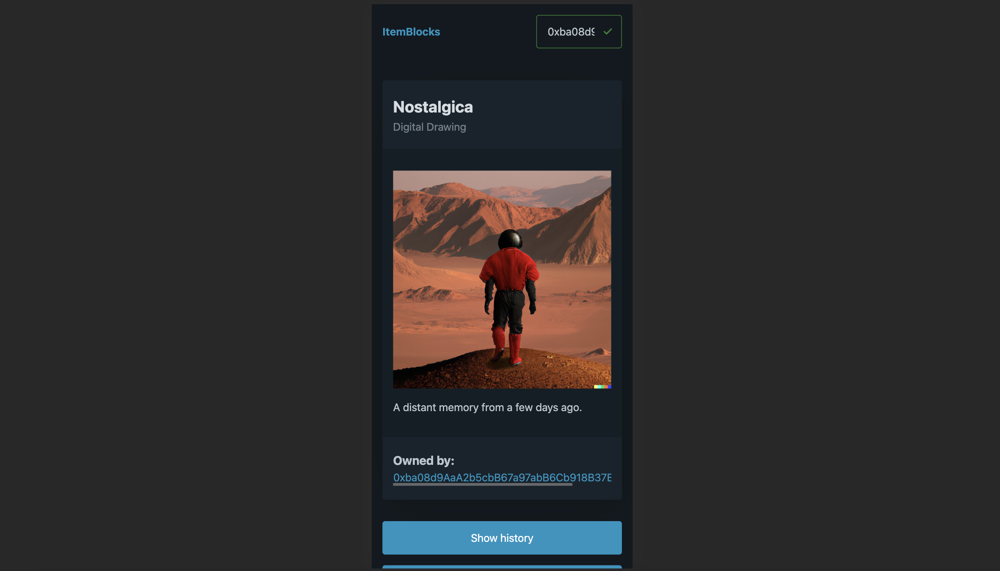
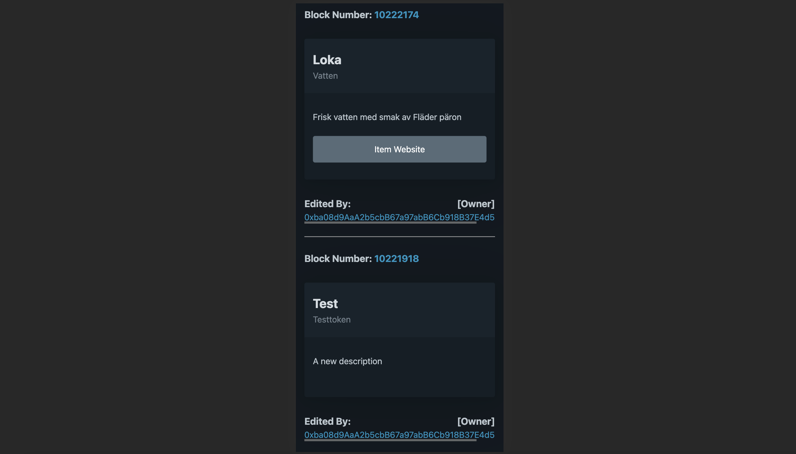
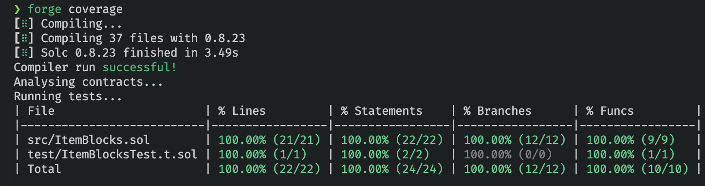
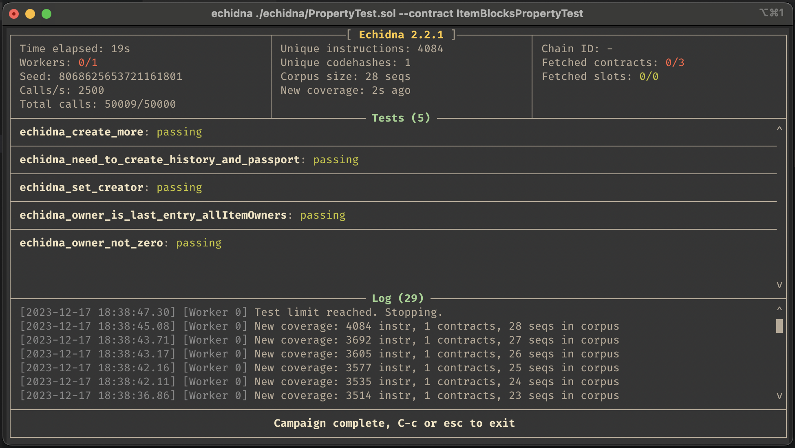

# ItemBlocks
Create a digital passport for your physical items.

## Check it out!

https://itemblocks.app.cloud.cbh.kth.se/

## Description

ItemBlocks allows users to create a digital passport for their physical items and make the information associated with these items easily accessible.
To bring an item into the application simply click on `create`, add the information, and the digital passport will be created on the Ethereum blockchain. The application will show a QR Code to the user which can be printed and put onto the physical item. The QR code is a link to our application with an encoding of the key that uniquely identifies this item on the blockchain. Other users can scan the QR-Code to easily access the data of this item on the blockchain. This has the potential to break down data silos, e.g. across company databases.

There are three roles in our system Owners, Creators, and Viewers. The Owner and the Creator of an item can edit the information about an item. Only Owners of an item can transfer the ownership to another user. All Ownership as well as information changes are stored on the blockchain. In our application, everyone can always access the information, ownership history, and update history of an item. In the update history, users can transparently see all changes that were made to the item passport, when they were made, which Ethereum address made the change, and if this address was the Creator or Owner of the item at the time of change.

## Testing

We used unit testing, static analysis as well as fuzzing to test our contract.
We were able to achieve 100% test coverage and good results in the static analysis and fuzz tests.

_Read more about our test setup in our wiki._

### Coverage Report

### Static Analysis

You can find the static analysis report in markdown format here:
[Slither Report](./contract/Slither-Report.md)

### Fuzzing

## Technnology

Please check out our wiki.
